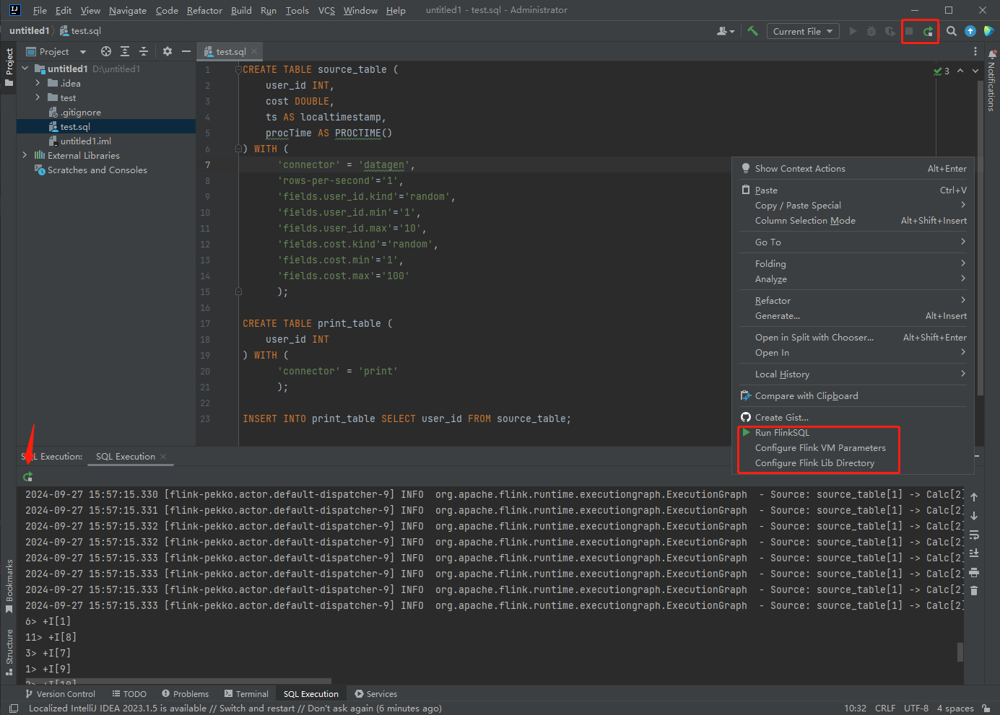

# FlinkSQL Plugin for IntelliJ IDEA

[Chinese Documentation](README_CN.md)

## Introduction
FlinkSQL-Plugin is an IntelliJ IDEA plugin developed 100% by cursor+claude3.5. It allows you to write FlinkSQL in IDEA and run it directly from the IDE. The plugin starts a local mini-cluster for execution.

## Use Cases
- Write FlinkSQL and run it directly in IDEA to improve development efficiency
- Debug FlinkSQL locally, e.g., debugging connectors, UDFs, etc.
- Enhance development efficiency when used in conjunction with other SQL plugins

## Operation Guide

1. Run FlinkSQL: Execute the FlinkSQL in the current file
2. Configure Flink VM parameters: Set VM parameters, e.g: -agentlib:jdwp=transport=dt_socket,server=y,suspend=y,address=5005
3. Configure Flink Lib Directory: Set the Flink lib directory where all Flink dependency JARs are located. Ensure all relevant dependencies are in this directory before running

Mini dependency
```
Mlink-1.0-SNAPSHOT.jar --FlinkSQL executes jars
flink-cep-1.18.1.jar
flink-connector-files-1.18.1.jar
flink-csv-1.18.1.jar
flink-dist-1.18.1.jar
flink-json-1.18.1.jar
flink-scala_2.12-1.18.1.jar
flink-table-api-java-uber-1.18.1.jar
flink-table-planner-loader-1.18.1.jar
flink-table-runtime-1.18.1.jar
```

## Usage
1. [Download the plugin](https://github.com/MOBIN-F/FlinkSQL-Plugin/releases/download/Release-1.0/FlinkSQL-Plugin-1.0.zip) and install it in IDEA. No need to restart IDEA
2. Download [Flink](https://flink.apache.org/downloads/) and decompression,Download [FlinkSQL executes jars](https://github.com/MOBIN-F/FlinkSQL-Plugin/releases/download/Release-1.0/Mlink-1.0-SNAPSHOT.jar),and put it under ${FLINK_HOME}/lib
3. Create a new test.sql file, right-click and select Run FlinkSQL from the context menu

## IDEA Version Compatibility
- IDEA 2022+

## Flink Version Compatibility
- Flink 1.15+