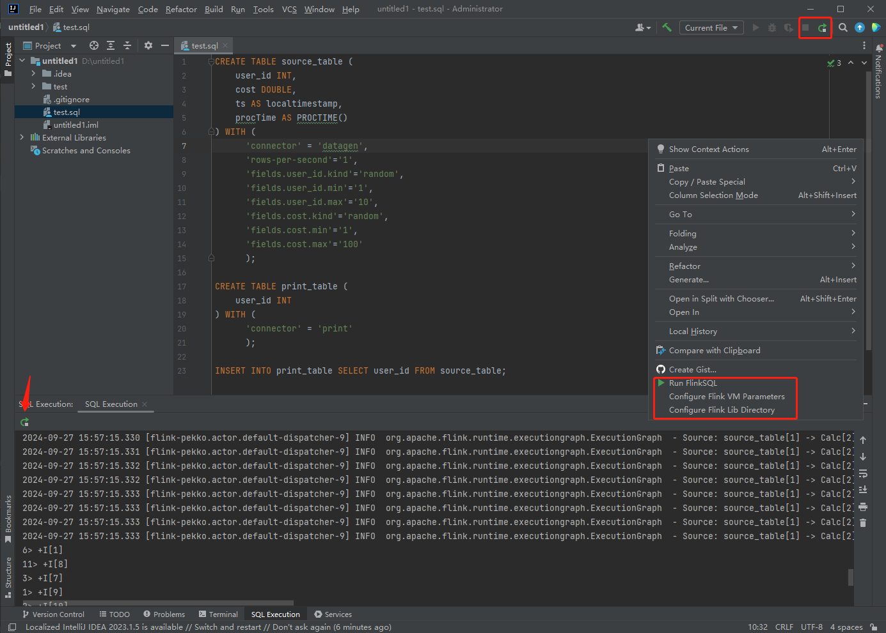

# FlinkSQL Plugin for IntelliJ IDEA

[英文文档](README.md)

## 简介
FlinkSQL-Plugin是一个由cursor+cluade3.5 100%开发的IDEA插件，用于在IDEA中编写FlinkSQL，并支持IDEA直接运行，会在本地启动一个mini-cluster

## 适用场景
- 编写FlinkSQL，并在idea上运行，提高开发效率
- 本地调试FlinkSQL,例如调试connector、udf等
- 配合其他SQL插件，开发效率更高

## 操作说明

1. Run FlinkSQL：运行当前文件中的FlinkSQL
2. Configure Flink VM parameters：配置VM参数，如：-agentlib:jdwp=transport=dt_socket,server=y,suspend=y,address=5005
3. Configure Flink Lib Directory：配置Flink的lib目录，Flink的依赖Jar都放在该目录下，运行之前请确保相关依赖都在该目录下

最小依赖：(移除log4j*.jar，避免日志冲突)
```
Mlink-1.0-SNAPSHOT.jar  --FlinkSQL执行jar包
flink-cep-1.18.1.jar
flink-connector-files-1.18.1.jar
flink-csv-1.18.1.jar
flink-dist-1.18.1.jar
flink-json-1.18.1.jar
flink-scala_2.12-1.18.1.jar
flink-table-api-java-uber-1.18.1.jar
flink-table-planner-loader-1.18.1.jar
flink-table-runtime-1.18.1.jar
```

## 使用方式
1. [下载插件](https://github.com/MOBIN-F/FlinkSQL-Plugin/releases/download/Release-1.0/FlinkSQL-Plugin-1.0.zip)，在IDEA中安装插件，无需重启IDEA
2. 下载[Flink](https://flink.apache.org/zh/downloads/)并解压，下载[FlinkSQL执行jar包](https://github.com/MOBIN-F/FlinkSQL-Plugin/releases/download/Release-1.0/Mlink-1.0-SNAPSHOT.jar)([source code](https://github.com/MOBIN-F/Mlink))，并放在${FLINK_HOME}/lib下
3. 新建test.sql，右键菜单选择Run FlinkSQL

## IDEA版本说明
- IDEA 2022+

## Flink版本说明
- Flink 1.15+